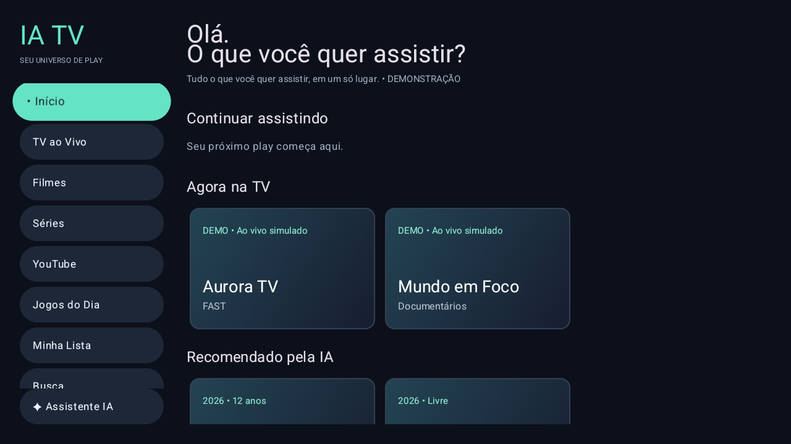

# IA TV

**Tudo o que você quer assistir, em um só lugar.**

Central de entretenimento nativa para Android TV / Google TV. Este primeiro milestone usa catálogo fictício da própria API, assistente por regras e sinal de vídeo próprio. Sem serviços comerciais de conteúdo, pagamentos ou IA externa.



## Estrutura
```text
apps/android-tv  Kotlin, Compose for TV, Hilt, Retrofit e Media3
apps/backend     NestJS, Prisma, providers mock e testes REST
apps/admin       Estrutura inicial Next.js (sem CRUD)
packages/contracts     DTOs TypeScript
packages/shared-types  Estratégia de tipos
packages/config        Configuração compartilhada
docs/ infra/ docker/ scripts/ .github/
```
Tizen e webOS são clientes futuros, ainda não implementados.

## Executar com PostgreSQL
Requisitos: Node.js 22+, Docker com serviço ativo. Para Android: Android Studio, JDK 21, SDK 35.

1. Copie `.env.example` para `.env` local e escolha uma senha de desenvolvimento. Não versionar `.env`.
2. Ajuste `DEMO_MEDIA_URL` para o endereço acessível pela TV. O padrão serve ao emulador Android.
3. Execute:
```powershell
docker compose up --build
```
O backend aplica migration e seed ao iniciar. API na porta 3000; Swagger em [localhost:3000/docs](http://localhost:3000/docs).

Para executar Node fora do container, exporte `DATABASE_URL`, `DATA_MODE=postgres` e `DEMO_MEDIA_URL` no terminal. O Node não carrega `.env` automaticamente.
```powershell
npm ci
npm run db:generate
npm run db:migrate
npm run db:seed
npm run build
npm run dev
```

## Demonstração sem banco
```powershell
npm ci
npm run db:generate
npm run build
$env:DATA_MODE = 'mock'
$env:DEMO_MEDIA_URL = 'http://10.0.2.2:3000/media/test-pattern.mp4'
npm run dev
```
O modo mock em memória é explícito e somente para desenvolvimento. A mídia de teste já acompanha o projeto. Para regenerar, use `scripts/generate-demo-media.ps1` com FFmpeg instalado.

## Android TV
```powershell
cd apps/android-tv
.\gradlew.bat assembleDebug testDebugUnitTest lintDebug
adb install -r app/build/outputs/apk/debug/app-debug.apk
adb shell am start -n com.iatv.app/.MainActivity
```
Para TV física, compile com `-PIATV_API_URL=http://IP-DO-PC:3000/` usando um IP válido. Configure a mesma máquina em `DEMO_MEDIA_URL`. APK debug permite HTTP local; release precisa de HTTPS.

## Validar
```powershell
npm run build
npm run lint
npm test
npm run build -w @iatv/admin
```
Resultados desta implementação em [docs/validation.md](docs/validation.md). O workflow CI deve ficar na raiz do repositório IA TV ao publicá-lo; neste workspace o projeto é uma subpasta.

## Estado atual
Milestone 1 — concluído. Milestone 2 — hardening em validação; aprovação física pendente.

Consulte o [baseline](docs/milestone-2-baseline.md), [relatório M2](docs/milestone-2.md),
[matriz de foco](docs/tv-focus-test-matrix.md), [plano físico](docs/physical-tv-test-plan.md),
[comandos ADB](docs/adb-tv-testing.md) e [arquitetura mobile futura](docs/mobile-architecture.md).

Para HLS/DASH próprios, execute `scripts/generate-stream-fixtures.ps1 -Mode vod` com FFmpeg
instalado. As saídas ficam em `apps/backend/media/generated/` (ignoradas pelo Git).
Use `DEMO_MEDIA_URL=http://10.0.2.2:3000/media/generated/vod.m3u8` ou `vod.mpd`.
Para live real de teste, mantenha `scripts/generate-stream-fixtures.ps1 -Mode live` executando
em outro terminal e configure `DEMO_LIVE_URL=http://10.0.2.2:3000/media/generated/live.m3u8`.
TV física usa IP da máquina. O sinal contém apenas padrão de teste e áudio próprios.
Não confundir o MP4 repetido legado com streaming live.

Diagnóstico: Configurações → Sobre → Diagnóstico. Builds CI incluem commit;
localmente usar `-PIATV_GIT_COMMIT=HASH`. Os dados copiados não incluem URL ou credenciais.

Home com menu e carrosséis, detalhes, catálogo fictício, agenda diária, busca, assistente mock, guia fictício e player de demonstração. Favoritos/cache/progresso locais no perfil demonstrativo. Admin apenas estrutural. Canais repetem sinal próprio, não uma transmissão ao vivo real. Séries ainda são cards demonstrativos, sem seleção de temporadas.

Auth, QR, múltiplos perfis, sincronização, pagamentos e integrações reais ficam fora desta primeira entrega. Veja [arquitetura](docs/architecture.md), [guia Android](docs/android-tv.md) e [próximo milestone](docs/roadmap.md).

## Milestone 2.5 — em andamento
Fundação de providers, diagnósticos administrativos e pesquisa do APK 5.2: [estado e bloqueios](docs/milestone-2.5.md). Integração e playback reais ainda não validados. Consulte a [matriz de contratos](docs/provider-contract-matrix.md).
